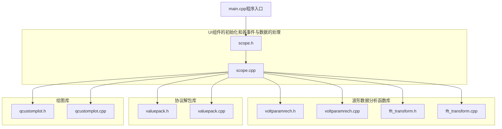

# Scope von Max_unterwegs<a name="j59YS"></a>

# 目录

 [Scope von Max_unterwegs](#j59YS)
    1 [项目介绍](#k2Hgs)
        1.1 [代码库分支/压缩包文件说明（找源代码必读）](#ZB3Aa)
        1.2 [项目内容与功能](#k898g)
    2 [硬件介绍](#yFIqg)
    3 [方案框图和项目设计思路介绍](#FjpSM)
        3.1 [项目设计思路](#YOOtW)
        3.2 [电路分析与资源分配](#vtloX)
        3.3 [方案框图与解释](#R1oCl)
        	3.3.1 [stm32部分](#R1oCs)
        	3.3.2 [Qt部分](#R1oCq)
    4 [软件流程图和关键代码介绍](#z9E4x)
        4.1 [stm32部分](#Y3l9O)
            4.1.1 [整合实现层部分关键代码](#NGILl)
            4.1.2 [应用层部分关键代码](#ijjpM)
            4.1.3 [模块层部分关键代码](#nBkQr)
        4.2 [Qt部分](#NPoz6)
    5 [功能展示图及使用说明](#mj29b)
        5.1 [stm32部分](#xQSQR)
        5.2 [Qt部分](#sVOBX)
    6 [项目中遇到的难题和解决方法](#OProu)
    7 [对本次活动的心得体会（包括意见或建议）](#BYxrz)
    8 [当前项目的不足与未来优化方向](#NOPxX)
    9 [参考](#mEywh)

## 1. 项目介绍<a name="k2Hgs"></a>

本项目是一个基于硬禾学堂“**寒假一起练——基于stm32的双通道示波器学习平台**”的板卡硬件实现的**口袋虚拟仪器**。代码开源到**github**上，链接如下：[GitHub - Max-unterwegs/scope-von-Max_unterwegs](https://github.com/Max-unterwegs/scope-von-Max_unterwegs/tree/master?tab=readme-ov-file)

### 1.1. 代码库分支/压缩包文件说明（找源代码必读）<a name="ZB3Aa"></a>

- - `master`：主分支，包含项目的即点即用文件

- - - `M_Uscope.exe`:Qt上位机程序，点击即用
    - `M_Uscope`：Qt上位机未打包程序
    - `scope.hex`：单片机hex文件，可用STM32CubeProgrammer、FlyMcu等烧录工具烧录。

- - - - ⚠️**<u>注意：其中M_Uscope.exe可能会被windows当做病毒删除，下载使用时关闭windows实时防护即可，如实在不行可以使用文件夹里的未打包程序或用Qtproject分支里的源代码直接编译出程序。</u>**⚠️

- - `Qtproject`：Qt项目分支，其中包含有Qt上位机程序源代码，使用Qt 6.5.3 QMake 3.1+MinGW-W64-builds-5.0.0工具链Release编译生成程序
  - `stm32project`：stm32项目分支，其中包含有stm32程序源代码，使用stm32cubemx+keil+vscode keil assistant插件 工具链基于HAL库编译生成程序

### 1.2. 项目内容与功能<a name="k898g"></a>

- **项目内容**

- - 基于STM32G031平台进行**电压数据采集**及**信号产生**，使用板上的OLED显示和按键/编码器**控制**相关功能与参数并提供**声音反馈**
  - 将该示波器平台同PC**连接**起来，利用PC的**数据处理能力和大屏幕显示**，实现**波形及其相关参数的**更好的测试测量显示效果

- **项目具体功能**

- - **stm32部分**

- - - **电压采样转换与串口按协议输出数据**

- - - - 量程、采样频率、采样开关可调

- - - **信号输出，支持大小与频率调节，直流、正弦、三角、锯齿、矩形波输出**

- - - - 波形类型、直流大小、直流pwm频率、波形频率、输出开关可调

- - - **按键及编码器控制相关功能与参数**
    - **OLED显示相关功能与参数**

- - - - 显示分频可调，按键调节位置光标显示

- - - **蜂鸣器按键与编码器反馈**
    - **电压、电流（需采样电阻）、电阻（有问题，具体见3.2电路分析部分手稿）测量**

- - **Qt部分**

- - - **数据串口搜索与选择**
    - **实时电压与Qt采样率显示（包括显示分频）**
    - **波形相关参数（包括显示分频）**

- - - - 最值、峰峰值、平均值、有效值、周期与频率、占空比与脉冲宽度

- - - **波形图像（支持图像缩放观察与多格式保存）**

- - - - **双通道时域图**

- - - - - 支持X-T模式与X-Y模式
        - 支持鼠标游标显示值
        - 支持曲线的可见与不可见
        - 支持数据滤波（滤波参数可调）

- - - - **FFT后的频域图**

- - - **作者信息显示**

## 2. 硬件介绍<a name="yFIqg"></a>

详细内容见：[基于STM32的简易示波器/频谱仪/信号发生器学习平台](https://www.eetree.cn/platform/662)

**板卡特性：**

- 基于STM32G031微控制器， Arm Cortex M0+内核，主频为64MHz
- 2个按键 + 1个光电旋转编码器用于控制输入 
- 1个SPI接口的OLED显示屏（128*128分辨率） 
- 1路音频放大电路用于产生ADC的测试信号，并可作为测试电路使用
- 一个蜂鸣器用于音效输出 
- 1路基于PWM的DDS信号输出，用于产生测试信号（任意波形）
- 2路增益可调的模拟信号输入，通过12bits ADC采集2mVpp - 30Vpp，带宽为100KHz的模拟信号

**核心器件STM32G031特性：**

- 内核: Arm® 32-bit Cortex®-M0+ CPU, 最高频率为64 MHz
- 存储器：

- - 8KBytes SRAM
  - 64Kbytes的Flash存储器，并有保护和安全区

- 12位, 0.4µs ADC (最多达16个外部通道)

- - 通过硬件过取样能够达到最多16位
  - 转换范围: 0 to 3.6V

- 11个定时器 (有一个可以支持到128 MHz): 1个用于先进马达控制的16-bit定时器, 一个32位和4个16位的通用定时器, 2个低功耗16位, 2个看门狗, SysTick定时器
- 通信接口

- - 2个I2C总线接口支持快速模式Plus (1Mbit/s)，需要额外的电流供应, 一个支持SMBus/PMBus并能够从Stop模式中唤醒
  - 2个USARTs并有着master/slave同步SPI; 一个支持ISO7816接口, LIN, IrDA, 自动波特率监测和唤醒功能
  - 1个低功耗UART
  - 2个SPIs (32Mbit/s)有4到16位可编程位帧，一个可以与I2S接口复用

- 开发支持: 串行线调试(SWD)
- 96位独特的ID

**硬件原理图：**


## 3. 方案框图和项目设计思路介绍<a name="FjpSM"></a>

### 3.1. 项目设计思路<a name="YOOtW"></a>

从需求的功能出发，一步步地分单片机与上位机两条路从需求到逻辑到功能到外设到相关电路分析与配置实现自顶向下地确定程序架构，而后从电路出发一步步地往上逐层封装应用与驱动函数最后自底向上实现程序功能与逻辑，具体思路见下面的电路分析、资源分配、框图与流程图

### 3.2. 电路分析与资源分配<a name="vtloX"></a>

**下面是关键部分电路的分析，会可跳过**


**蜂鸣器部分：**通过PWM信号控制三极管Q1的导通与截止来驱动蜂鸣器（BZ1）发出声音。


**电压采样部分：**为一减法运算电路，对外部电压进行缩小与偏置后连接到单片机上，关系推导如下


**直流输出部分：**单片机输出PWM波后，经两轮低通滤波后通过电压跟随器输出对应的电压值

下面是研读电路后整理的其余电路部分资源使用计划的表格，后附实际配置图：

| 部分          | 作用              | 备注            | 用户名称  | 本质        | 引脚     |
| ------------- | ----------------- | --------------- | --------- | ----------- | -------- |
| 串口          | USART2通信        |                 |           | USART       | PA2, PA3 |
| 按键          | 输入信号          | 有上拉          | key1      | GPIO_INPUT  | PA4      |
| 有上拉        | key2              | GPIO_INPUT      | PA5       |             |          |
| 编码器        | key4              | GPIO_INPUT      | PB3       |             |          |
| 编码器        | 输入信号          | 有上拉          | key3      | EXTI        | PA15     |
| 有上拉        | key5              | GPIO_INPUT      | PB4       |             |          |
| OLED          | 数据/命令控制     |                 | OLED_DC   | GPIO        | PB5      |
| 片选信号      |                   | OLED_RES        | GPIO      | PB6         |          |
| SPI通信数据线 | SPI2              | SPI2_MOSI       | SPI2_MOSI | PB7         |          |
| SPI通信时钟线 | SPI2              | SPI2_SCK        | SPI2_SCK  | PB8         |          |
| 备用I2C       | I2C通信数据线     | I2C2            | I2C2_SDA  | I2C2_SDA    | PA12     |
|               | I2C通信时钟线     | I2C2            | I2C2_SCL  | I2C2_SCL    | PA11     |
| 灯            | 输出信号          | 另一端地        |           | GPIO_Output | PC14     |
| 蜂鸣器        | 通过PWM控制声音   |                 |           | GPIO_Output | PC15     |
| 电子开关      | 触发改变电路      | 高1低3          | SW1       | GPIO_Output | PA6,Ain1 |
| SW2           | GPIO_Output       | PB1,Ain2        |           |             |          |
| ADC，Uout     | 运放输出          | 见前面公式推导  | Ain1      | ADC1_in1    | PA1,Ain1 |
| Ain2          | ADC1_in7          | PA7,Ain2        |           |             |          |
| DC            | 低通滤波，pwm转DC | 初始psc0 arr100 | DC1       | T3_C1 PWM   | PA6,Ain1 |
| DC2           | T3_C4 PWM         | PB1,Ain2        |           |             |          |
| mic和内联输入 | 放大10倍电压输出  |                 |           | GPIO        | PA0      |
| 稳压电路      | 滤波+电压跟随输出 |                 |           | T3_C3 PWM   | PB0      |
| 存储器        | 程序存储器        | 13kflash        |           |             |          |
| 数据存储器    | 2kRAM             |                 |           |             |          |


### 3.3. 方案框图与解释<a name="R1oCl"></a>

#### 3.3.1. stm32部分<a name="R1oCs"></a>


**各部分详细的描述可以见图**，从硬件电路出发（硬件层），资源引脚分配后通过cubemx配置与HAL库实现外设功能的硬件抽象层，随后使用HAL库函数编写根据任务需求封装的易用的各模块部分的驱动函数库（模块层），并在应用层中基于这些模块层的API面向功能实现所需要的应用功能函数，最后在整合实现层根据模式、功能、运行逻辑等对应用层API进行选用与整合最后实现程序功能

#### 3.3.2. Qt部分<a name="R1oCq"></a>




**关键文件功能如下：**

- main.cpp：程序入口，初始化应用程序并显示主窗口。
- scope.h 和 scope.cpp：主窗口类，包含UI组件的初始化和各事件处理。
- voltparamrech.h 和 voltparamrech.cpp：波形参数计算函数库
- fft_transform.h 和 fft_transform.cpp：FFT变换使用封装函数库
- valuepack.h 和 valuepack.cpp：数据包处理函数库
- qcustomplot.h 和 qcustomplot.cpp：绘图库，用于绘制波形图和频谱图。

## 4. 软件流程图和关键代码介绍<a name="z9E4x"></a>

### 4.1. stm32部分<a name="Y3l9O"></a>


**关键代码：（功能描述可见程序框图，仅给出关键部分，其余相对容易实现或为开源库，可自行看源代码，流程图描述部分除发包外均会展示涉及）(注释由于时间仓促仅写了函数注释和部分代码注释，作者仁济所以可能会有问题，请见谅QAQ)**

#### 4.1.1. 整合实现层部分关键代码<a name="NGILl"></a>

```c
//开机时必要的初始化
/* USER CODE BEGIN 2 */
  HAL_TIM_Base_Start_IT(&htim17);
  showinit();
  init_status();
/* USER CODE END 2 */
  /* USER CODE BEGIN WHILE */
  while (1)
  {
    main_status();//主程序函数
    /* USER CODE END WHILE */

    /* USER CODE BEGIN 3 */
  }
  /* USER CODE END 3 */
}
/*
 * @Date: 2025-02-05 18:01:42
 * @LastEditors: Max-unterwegs && max_unterwegs@126.com 
 * @LastEditTime: 2025-03-07 19:56:43
 * @FilePath: \MDK-ARMd:\Mein_Werk\scope_project\Core\App\Src\status.c
 * @Description: 根据状态调节执行功能模式
 */
#include "status.h"

int status = 1;//0:SCOPE 1:MESSER 2:MU

/**
 * @brief 状态初始化
 * @param void
 * @return void
 * @note 根据状态初始化相应功能
 * @attention 无
 * @Author Max_unterwegs
 */
void init_status()
{
    switch (status)
    {
    case SCOPE_STATUS:
        scope_init();
        break;
    case MESSER_STATUS:
        messer_init();
        break;
    case MU_STATUS:
        mu_init();
        break;
    default:
        break;
    }
}
/**
 * @brief 状态主函数
 * @param void
 * @return void
 * @note 根据状态执行相应功能
 * @attention 无
 * @Author Max_unterwegs
 */
void main_status()
{
    switch (status)
    {
    case SCOPE_STATUS:
        scope_main();
        break;
    case MESSER_STATUS:
        messer_main();
        break;
    case MU_STATUS:
        mu_main();
        break;
    default:
        break;
    }
   
}
/*
 * @Date: 2025-02-06 18:56:18
 * @LastEditors: Max-unterwegs && max_unterwegs@126.com 
 * @LastEditTime: 2025-03-08 10:32:27
 * @FilePath: \scope_project\Core\Modeandmain\Src\mode.c
 */
#include "mode.h"
#include "function.h"
#include "status.h"
#include "show.h"
#include "send.h"


float voltages[3];//0:CH1 1:CH2 2:Verfint
float res[2];//0:R1 1:R2
int functionshow[5] = {1, 1, 10,0,3};//0:DC 1:CH 2:Hz 3:wave 4:SHOW
float paramshow[7] = {100, 10.1, 10.1, 3.3, 1000000,3.3,0};//0:DCarr 1:CH1mv 2:CH2mv 3:DCv 4:CHf 5:ACA 6:ACV


/**
 * @brief 采样与输出模式初始化
 * @param void
 * @return void
 * @note 功能包括通道采样，交流电输出，数据发送与状态模式显示，相关参数调节，其余状态显示
 * @author Max_unterwegs
 */
void scope_init(void)
{
    // 初始化通道采样
    CH_control(functionshow[1]);
    // 初始化直流电输出
    DC_control(functionshow[0], paramshow[0]); // 示例参数
    // 初始化数据发送
    sendinit();
}

/**
 * @brief 采样与输出模式主函数
 * @param void
 * @return void
 * @note 功能包括通道采样，交流电输出，数据发送与状态模式显示，相关参数调节，其余状态显示
 * @author Max_unterwegs
 */
void scope_main(void)
{
    // 初始化直流电输出
    DC_control(functionshow[0], paramshow[0]); // 示例参数
    // 执行直流电输出
    DC_vcontrol(paramshow[3]); // 示例电压值
    // 执行相关参数调节
    CH_fcontrol(paramshow[4], functionshow[1]);
    // 初始化通道采样
    CH_control(functionshow[1]);
    CH_vcontrol(1,(int)paramshow[1]);
    CH_vcontrol(2,(int)paramshow[2]);
    // 执行通道采样
    VOLT_ReadVoltages(voltages);
    //转换实际电压值
    voltage_map(voltages);
    // 执行数据发送
    sendvolt(voltages);
    // 执行其余状态显示
    showshow();
}

/**
 * @brief 万用表模式初始化
 * @note 功能包括电压测量，电阻测量，通断测量，直流电输出，数据发送与状态显示，相关参数调节
 * @param void
 * @return void
 * @author Max_unterwegs
 */
void messer_init(void)
{
    // 初始化通道采样
    CH_control(functionshow[1]);
    // 初始化直流电输出
    DC_control(functionshow[0], paramshow[0]); // 示例参数
    // 初始化数据发送
    sendinit();
}

/**
 * @brief 万用表模式主函数
 * @note 功能包括电压测量，电阻测量，通断测量，数据发送与状态显示，相关参数调节
 * @bug 电阻测量功能有问题
 * @param void
 * @return void
 * @author Max_unterwegs
 */
void messer_main(void)
{
     
     // 初始化直流电输出
     DC_control(functionshow[0], paramshow[0]); // 示例参数
     // 执行直流电输出
     DC_vcontrol(paramshow[3]); // 示例电压值
     // 执行相关参数调节
     CH_fcontrol(paramshow[4], functionshow[1]);
     // 初始化通道采样
     CH_control(functionshow[1]);
     CH_vcontrol(1,(int)paramshow[1]);
     CH_vcontrol(2,(int)paramshow[2]);
     // 执行通道采样
     VOLT_ReadVoltages(voltages);

    // 执行电阻测量
    Get_Res(paramshow[3],res,voltages);
     //转换实际电压值
     voltage_map(voltages);

     // 执行数据发送
     sendvolt(voltages);
     sendres(res);
     // 执行其余状态显示
     showshow();


}

/**
 * @brief 自定义整活模式初始化
 * @param void
 * @return void
 * @note 目前没有功能
 * @author Max_unterwegs
 */
void mu_init(void)
{
    // 预留初始化代码
}

/**
 * @brief 自定义整活模式主函数
 * @param void
 * @return void
 * @note 目前没有功能
 * @author Max_unterwegs
 */
void mu_main(void)
{
    // 预留主函数代码
}
/**
 * @brief 停止所有功能
 * @param void
 * @return void
 * @note 停止所有功能，包括通道采样，交流电输出，数据发送与状态模式显示，相关参数调节，其余状态显示
 * @author Max_unterwegs
 */
void allstop()
{
        // 停止通道采样
        HAL_ADC_Stop_DMA(&ADC_handle);
        HAL_TIM_Base_Stop(&CH_HAL_TIM);
        HAL_TIM_PWM_Stop(&CH1_HAL_TIM, CH1_CHANNEL);
        HAL_TIM_PWM_Stop(&CH2_HAL_TIM, CH2_CHANNEL);
        HAL_TIM_Base_Stop(&CH1_HAL_TIM);
        HAL_TIM_Base_Stop(&CH2_HAL_TIM);
    
        // 停止直流电输出
        HAL_TIM_PWM_Stop(&OUT_HAL_TIM, OUT_CHANNEL);
        HAL_TIM_Base_Stop(&OUT_HAL_TIM);
    
}
```

#### 4.1.2. 应用层部分关键代码<a name="ijjpM"></a>

```c
/*
 * @Date: 2025-02-05 18:02:21
 * @LastEditors: Max-unterwegs && max_unterwegs@126.com 
 * @LastEditTime: 2025-03-08 11:02:02
 * @FilePath: \MDK-ARMd:\Mein_Werk\scope_project\Core\App\Src\function.c
 * @Description: 功能应用函数封装
 */
#include "function.h"

/**
 * @brief 直流电压开关频率控制
 * @param isopen: 0-关闭 1-打开
 * @param arris: 自动重装载值
 * @return void
 * @note 控制直流电压pwm输出
 * @author Max_unterwegs
 */
void DC_control(char isopen, int arris)
{
    static char ispwmopen = 0;
    if(isopen == 0)
    {
        HAL_TIM_PWM_Stop( &OUT_HAL_TIM ,OUT_CHANNEL);
        HAL_TIM_Base_Stop( &OUT_HAL_TIM );
        ispwmopen = 0;
    }
        
    else
    {
        __HAL_TIM_SET_AUTORELOAD(&OUT_HAL_TIM, arris);
        OUT_HAL_TIM.Instance->CNT = 0;
        if(ispwmopen == 0)
        {
            ispwmopen = 1;
            PWM_OUT_Init();
        }
    }
        
}


/**
 * @brief 直流电压控制
 * @param dcvalue: 电压值
 * @return void
 * @note 控制直流电压输出
 * @attention dcvalue范围0-3.3V
 * @author Max_unterwegs
 */
void DC_vcontrol(float dcvalue)
{

    DC_OUT( OUT_TIM , OUT_CHANNEL, dcvalue, paramshow[0]);
    
}
/**
 * @brief 交流电压开关频率控制
 * @param isCHopen: 0-关闭 1-打开
 * @return void
 * @note 控制交流电压输入开关，更新模式
 * @author Max_unterwegs
 */
void CH_control(char isCHopen)
{
    static char ischpwmopen = 0;
    if(isCHopen == 0)
    {
        HAL_ADC_Stop_DMA( &ADC_handle );
        HAL_TIM_Base_Stop( &CH_HAL_TIM );
        HAL_TIM_PWM_Stop( &CH1_HAL_TIM ,CH1_CHANNEL);
        HAL_TIM_PWM_Stop( &CH2_HAL_TIM ,CH2_CHANNEL);
        HAL_TIM_Base_Stop( &CH1_HAL_TIM );
        HAL_TIM_Base_Stop( &CH2_HAL_TIM );
        ischpwmopen = 0;
    }
    else
    {
        for(int i=0;i<ADC_CHANNEL_NUM;i++)
        {
            adcValues[i] = 0;
        }
        if(ischpwmopen == 0)
        {
            ischpwmopen = 1;
            HAL_TIM_Base_Start( &CH_HAL_TIM );
            PWM_CH_Init();
            VOLT_Init();
        }
    }
}
/**
 * @brief 通道量程控制
 * @param chnum: 1-CH1 2-CH2
 * @param chvmode: 2-2倍 ±3.3V 10-10倍 ±16.65V
 * @return void
 * @note 控制通道量程
 * @author Max_unterwegs
 */
void CH_vcontrol(char chnum,char chvmode)
{
    switch (chnum)
    {
        case 1:
            switch (chvmode)
            {
            case 2:
                HAL_GPIO_WritePin(SW1_GPIO_Port,SW1_Pin,GPIO_PIN_RESET);
                DC_OUT( CH1_TIM ,CH1_CHANNEL,1.1,paramshow[0]);
                break;
            
            case 10:
                HAL_GPIO_WritePin(SW1_GPIO_Port,SW1_Pin,GPIO_PIN_SET);
                DC_OUT( CH1_TIM ,CH1_CHANNEL,1.50123,paramshow[0]);
                break;
            default:
                break;
            }

            break;
        case 2:
            switch (chvmode)
            {
            case 2:
                HAL_GPIO_WritePin(SW2_GPIO_Port,SW2_Pin,GPIO_PIN_RESET);
                DC_OUT( CH2_TIM ,CH2_CHANNEL,1.1,paramshow[0]);
                break;
            
            case 10:
                HAL_GPIO_WritePin(SW2_GPIO_Port,SW2_Pin,GPIO_PIN_SET);
                DC_OUT( CH2_TIM ,CH2_CHANNEL,1.50123,paramshow[0]);
                break;
            default:
                break;
            }
            break;

        default:
            break;
    }
}
/**
 * @brief 通道采样率控制
 * @param freq: 采样率
 * @param isCHopen: 0-关闭 1-打开
 * @return void
 * @note 控制通道采样率
 * @author Max_unterwegs
 */
void CH_fcontrol(float freq ,char isCHopen) {
    if(isCHopen == 1)
    {
        HAL_TIM_Base_Stop( &CH_HAL_TIM );
        HAL_ADC_Stop_DMA( &ADC_handle );
        uint32_t prescaler = 1;
        while ((float) HCLK / (float) prescaler / freq > 65535) {
            do {
                prescaler++;
            } while (HCLK % prescaler);
        }
        CH_HAL_TIM.Instance->PSC = prescaler - 1;
        CH_HAL_TIM.Instance->ARR = (uint16_t) ((float) HCLK / (float) prescaler / freq) - 1;
        
        for(int i=0;i<ADC_CHANNEL_NUM;i++)
        {
            adcValues[i] = 0;
        }

        HAL_TIM_Base_Start( &CH_HAL_TIM );
        VOLT_Init();
    }
    
}
/**
 * @brief 电压映射
 * @param mapbuffer: 映射缓存
 * @return void
 * @note 将读取的电压值映射到实际电压值
 * @author Max_unterwegs
 */
void voltage_map(float* mapbuffer)
{
    mapbuffer[0] = (1.65 - mapbuffer[0])*paramshow[1];
    mapbuffer[1] = (1.65 - mapbuffer[1])*paramshow[2];
}
/**
 * @brief 电阻计算
 * @param vsvalue: 直流输入电压值
 * @param resbuffer: 电阻缓存
 * @param mapbuffer: 映射缓存
 * @return void
 * @note 计算电阻值
 * @author Max_unterwegs
 */
void Get_Res(float vsvalue,float* resbuffer,float* mapbuffer)
{
    resbuffer[0] = vsvalue*(1000000.0/paramshow[1])/(1.65-mapbuffer[0])-1000000.0;
    resbuffer[1] = vsvalue*(1000000.0/paramshow[2])/(1.65-mapbuffer[1])-1000000.0;
    if(resbuffer[0] < 70)
    {
        functionshow[2] = 1;   
    }
    if(resbuffer[1] < 70)
    {
        functionshow[2] = 1;   
    }
    resbuffer[0] = resbuffer[0] > 1000000? 1000000 : resbuffer[0];
    resbuffer[1] = resbuffer[1] > 1000000? 1000000 : resbuffer[1];
    
}
```

#### 4.1.3. 模块层部分关键代码<a name="nBkQr"></a>

```c
/*
 * @Date: 2025-02-04 10:30:55
 * @LastEditors: Max-unterwegs && max_unterwegs@126.com 
 * @LastEditTime: 2025-03-08 11:04:38
 * @FilePath: \MDK-ARMd:\Mein_Werk\scope_project\Core\Lib\Src\key.c
 * @Description: 按键与编码器扫描相关函数，波形生成相关代码
 */
#include "key.h"
#include "waveform_data.h"//波形数据

select_Typedef select = {1,0};//选择状态
volatile uint8_t EC11_A_Last = 0; // 上一次A相状态
volatile uint8_t EC11_B_Last = 0; // 上一次B相状态
int8_t B_level = 0, encoder_value = 0;//编码器值
uint8_t paramlist[7] = {3, 1, 2, 0, 4, 5, 6};//参数顺序列表
int keycount = 0;//按键计数
int sample_index = 0;//波形索引
float sample_indexf = 0.0;//波形频率时间计数

/**
 * @brief  按键扫描函数
 * @param  GPIOx：x 可以是 A，B，C，D或者 E
 * @param  GPIO_Pin：待读取的端口位
 * @return KEY_OFF(没按下按键)、KEY_ON（按下按键）、KEY_HOLD（长按按键）、KEY_IDLE（空闲状态）
 * @note   按键扫描函数，通过状态机的方式实现，参考博客https://blog.csdn.net/m0_46704668/article/details/113360878
 * @attention 无
 * @author Max_unterwegs
 */
uint8_t Key_Scan(GPIO_TypeDef *GPIOx, uint16_t GPIO_Pin)
{
    KEY_TypeDef *KeyTemp; // 定义一个按键类型的指针变量
    uint8_t ReturnTemp; // 定义一个返回值变量

    // 检查按下的是哪一个按钮
    switch ((uint32_t)GPIOx)
    {
        case ((uint32_t)key1_GPIO_Port): // 如果按下的是KEYA
            switch (GPIO_Pin)
            {
            case key1_Pin: // 如果按下的是KEY1的引脚
                KeyTemp = &Key[0]; // 将KeyTemp指向Key数组的第一个元素
                break;
            case key2_Pin: // 如果按下的是KEY2的引脚
                KeyTemp = &Key[1]; // 将KeyTemp指向Key数组的第二个元素
                break;
            case key3_Pin: // 如果按下的是KEY3的引脚
                KeyTemp = &Key[2]; // 将KeyTemp指向Key数组的第三个元素
                break;
            // port和pin不匹配
            default:
                //printf("error: GPIO port pin not match\r\n"); // 打印错误信息
                return KEY_IDLE; // 返回空闲状态
            }
            break;
       
        case ((uint32_t)key4_GPIO_Port): // 如果按下的是KEY4
            switch (GPIO_Pin)
            {
            case key4_Pin: // 如果按下的是KEY4的引脚
                KeyTemp = &Key[3]; // 将KeyTemp指向Key数组的第四个元素
                break;
            case key5_Pin: // 如果按下的是KEY5的引脚
                KeyTemp = &Key[4]; // 将KeyTemp指向Key数组的第五个元素
                break;
            // port和pin不匹配
            default:
                //printf("error: GPIO port pin not match\r\n"); // 打印错误信息
                return KEY_IDLE; // 返回空闲状态
            }
            break;
        default:
            //printf("error: key do not exist\r\n"); // 打印错误信息
            return KEY_IDLE; // 返回空闲状态
        }

    KeyTemp->KeyPhysic = HAL_GPIO_ReadPin(GPIOx, GPIO_Pin); // 读取按键的物理状态

    /* 检测按下、松开、长按 */
    switch (KeyTemp->KeyLogic)
    {
    case KEY_ON:
        switch (KeyTemp->KeyPhysic)
        {
        //（1，1）中将关闭计数清零，并对开启计数累加直到切换至逻辑长按状态
        case KEY_ON:
            KeyTemp->KeyOFFCounts = 0; // 关闭计数清零
            KeyTemp->KeyONCounts++; // 开启计数累加
            KeyTemp->MulClickCounts = 0; // 多击计数清零
            
            if(KeyTemp->MulClickFlag == KEY_2ClICK){ // 如果预备双击状态，但仍然只有一次点击
                if (KeyTemp->KeyONCounts >= HOLD_COUNTS){ // 如果开启计数达到长按计数
                    KeyTemp->KeyONCounts = 0; // 开启计数清零
                    KeyTemp->KeyLogic = KEY_HOLD; // 切换至逻辑长按状态
                    return KEY_HOLD; // 返回长按状态
                }
            }
            return KEY_IDLE; // 返回空闲状态

        //（1，0）中对关闭计数累加直到切换至逻辑关闭状态
        case KEY_OFF:
            KeyTemp->KeyOFFCounts++; // 关闭计数累加
            
            if (KeyTemp->KeyOFFCounts >= SHAKES_COUNTS) // 如果关闭计数达到抖动计数
            {
                KeyTemp->KeyLogic = KEY_OFF; // 切换至逻辑关闭状态
                KeyTemp->KeyOFFCounts = 0; // 关闭计数清零
                
                return KEY_OFF; // 返回关闭状态
            }
            return KEY_IDLE; // 返回空闲状态

        default:
            break;
        }

    case KEY_OFF:
        switch (KeyTemp->KeyPhysic)
        {
        //（0，1）中对开启计数累加直到切换至逻辑开启状态
        case KEY_ON:
            (KeyTemp->KeyONCounts)++; // 开启计数累加
            if (KeyTemp->KeyONCounts >= SHAKES_COUNTS) // 如果开启计数达到抖动计数
            {
                KeyTemp->KeyLogic = KEY_ON; // 切换至逻辑开启状态
                KeyTemp->KeyONCounts = 0; // 开启计数清零

                if(KeyTemp->MulClickFlag == KEY_1ClICK) // 如果是单击状态
                {
                    KeyTemp->MulClickFlag = KEY_2ClICK; // 切换至预备双击状态
                    return KEY_ON; // 返回开启状态
                }
                else
                {
                    if(KeyTemp->MulClickFlag != (KEY_MAX_MULCLICK + 1)) // 如果多击状态未达到最大值
                    {
                        KeyTemp->MulClickFlag++; // 多击状态累加
                        KeyTemp->MulClickCounts = 0; // 多击计数清零
                    }					
                }		
                // return KEY_ON; // 返回开启状态		
            }
            return KEY_IDLE; // 返回空闲状态

        //（0，0）中将开启计数清零，对多击计数
        case KEY_OFF:
            (KeyTemp->KeyONCounts) = 0; // 开启计数清零
            if(KeyTemp->MulClickFlag != KEY_1ClICK) // 如果不是单击状态
            {
                if(KeyTemp->MulClickCounts++ > MULTIPLE_CLICK_COUNTS) // 如果多击计数超过最大间隔时间
                {
                    ReturnTemp = KeyTemp->MulClickFlag - 1; // 返回多击状态减一
                    KeyTemp->MulClickCounts = 0; // 多击计数清零
                    KeyTemp->MulClickFlag = KEY_1ClICK; // 切换至单击状态
                    return ReturnTemp; // 返回多击状态
                }
            }
            
            return KEY_IDLE; // 返回空闲状态
        default:
            break;
        }

    case KEY_HOLD:
        switch (KeyTemp->KeyPhysic)
        {
        //（2，1）对关闭计数清零
        case KEY_ON:
            KeyTemp->KeyOFFCounts = 0; // 关闭计数清零
            KeyTemp->MulClickFlag = 0; // 多击状态清零
            KeyTemp->MulClickCounts = 0; // 多击计数清零
            return KEY_HOLD; // 返回长按状态
        //（2，0）对关闭计数累加直到切换至逻辑关闭状态
        case KEY_OFF:
            (KeyTemp->KeyOFFCounts)++; // 关闭计数累加
            if (KeyTemp->KeyOFFCounts >= SHAKES_COUNTS) // 如果关闭计数达到抖动计数
            {
                KeyTemp->KeyLogic = KEY_OFF; // 切换至逻辑关闭状态
                KeyTemp->KeyOFFCounts = 0; // 关闭计数清零
                return KEY_OFF; // 返回关闭状态
            }
            return KEY_IDLE; // 返回空闲状态

        default:
            break;
        }

    
    default:
        break;
    }
    return KEY_ERROR; // 返回错误状态
}

/**
 * @brief 编码器下降沿中断回调函数
 * @param GPIO_Pin: 引脚号
 * @return void
 * @note 编码器下降沿中断回调函数，用于检测编码器旋转方向
 * @attention 无
 * @author Max_unterwegs
 */
void HAL_GPIO_EXTI_Falling_Callback(uint16_t GPIO_Pin)
{
    B_level = HAL_GPIO_ReadPin(key5_GPIO_Port, key5_Pin);
}
/**
 * @brief 编码器上升沿中断回调函数
 * @param GPIO_Pin: 引脚号
 * @return void
 * @note 编码器上升沿中断回调函数，用于检测编码器旋转方向
 * @attention 无
 * @author Max_unterwegs
 */
void HAL_GPIO_EXTI_Rising_Callback(uint16_t GPIO_Pin)
{

        if(B_level==1 && HAL_GPIO_ReadPin(key5_GPIO_Port,key5_Pin) == 0) 
		{
            buzzer_on();
			encoder_value = 1;//正转
		}
		else if(B_level==0 && HAL_GPIO_ReadPin(key5_GPIO_Port,key5_Pin) == 1)
		{
            buzzer_on();
			encoder_value = -1;//反转
        }
        else
        {
            buzzer_off();
            encoder_value = 0;//无效
		}	 
    
    switch (encoder_value)
        {
        case 1:
        {
            switch (select.forp)
            {
            case 0:
                switch (select.index)
                {
                    case 4:
                        functionshow[select.index] = (functionshow[select.index] + 1 - 2) % 199 + 2;
                        break;
                    case 2:
                        functionshow[select.index] = (functionshow[select.index] + 1) % 500;
                        break;
                    case 3:
                        functionshow[select.index] = (functionshow[select.index] + 1) % 4;
                        break;
                    default:
                        functionshow[select.index] = !functionshow[select.index];
                        break;
                }
                break;
            case 1:
            {
                switch (paramlist[select.index])
                {
                case 0:
                    paramshow[0] = paramshow[0] + 100;
                    break;
                case 1:
                    paramshow[1] = (paramshow[1] == (float)10.1) ? 2 : 10.1;
                    break;
                case 2:
                    paramshow[2] = (paramshow[2] == (float)10.1) ? 2 : 10.1;
                    break;
                case 3:
                    paramshow[3] = (float)(((int)(paramshow[3] * 10 + 1)) % 34) / 10.0;
                    break;
                case 4:
                    paramshow[4] = paramshow[4] + 100000;
                    break;
                case 5:
                    paramshow[5] = paramshow[5] == 3.3? 3.3:(paramshow[5]+0.1);
                    break;
                case 6:
                    paramshow[6] = (paramshow[6]+paramshow[5] > 3.3)? paramshow[6]:(paramshow[6]+0.1);
                    break;
                default:
                    break;
                }
            }
            break;
            default:
                break;
            }
        }
        break;

        case -1:
        {
            switch (select.forp)
            {
            case 0:
                switch (select.index)
                {
                    case 4:
                        functionshow[select.index] = (functionshow[select.index] - 3) % 199 + 2;
                        break;
                    case 2:
                        functionshow[select.index] = (functionshow[select.index] + 499) % 500;
                        break;
                    case 3:
                        functionshow[select.index] = (functionshow[select.index] + 3) % 4;
                        break;
                    default:
                        functionshow[select.index] = !functionshow[select.index];
                        break;
                }
                break;
            case 1:
            {
                switch (paramlist[select.index])
                {
                case 0:
                    paramshow[0]= paramshow[0] == 100?100:(paramshow[0]- 100);
                    break;
                case 1:
                    paramshow[1] = (paramshow[1] == (float)2) ? 10.1 : 2;
                    break;
                case 2:
                    paramshow[2] = (paramshow[2] == (float)2) ? 10.1 : 2;
                    break;
                case 3:
                    paramshow[3] = (float)(((int)(paramshow[3] * 10 - 1 + 34)) % 34) / 10.0;
                    break;
                case 4:
                    paramshow[4] = paramshow[4] == 100000?100000:(paramshow[4] - 100000);
                    break;
                case 5:
                    paramshow[5] = paramshow[5] == 0.0? 0.0:(paramshow[5]-0.1);
                    break;
                case 6:
                    paramshow[6] = (paramshow[6] == 0.0)? 0.0:(paramshow[6]-0.1);
                    break;
                default:
                    break;
                }
            }
            break;
            default:
                break;
            }
        }
        break;

        default:
            break;
        }
}
/**
 * @brief 定时器回调函数
 * @param htim: 定时器句柄
 * @return void
 * @note 定时器回调函数，用于按键扫描，波形生成
 * @attention 无
 * @author Max_unterwegs
 */
void HAL_TIM_PeriodElapsedCallback(TIM_HandleTypeDef *htim)
{
    if (htim == &htim17)
    {
        keycount = (keycount + 1) % 20;
        buzzer_off();
        if(keycount == 0)    
        {
            if (Key_Scan(key2_GPIO_Port, key2_Pin) == KEY_ON)
            {
                buzzer_on();
                allstop();
                status = (status + 1) % 3;
                // printf("statusvalue: %d\r\n", status);
                init_status();
            }
            if (Key_Scan(key1_GPIO_Port, key1_Pin) == KEY_ON)
            {
                buzzer_on();
                select.forp = !select.forp;
                // printf("selectvalue: %d\r\n", select.forp);
            }
            if (Key_Scan(key4_GPIO_Port, key4_Pin) == KEY_ON)
            {
                buzzer_on();
                if(select.forp == 0)
                {
                    select.index = (select.index + 1) % 5;
                    // printf("selectindex: %d\r\n", select.index);
                }
                else
                {
                    select.index = (select.index + 1) % 7;
                    // printf("selectindex: %d\r\n", select.index);
                }
            }
        }
        // 计算当前采样点
        float frequency = (float)functionshow[2]/10.0; // 获取频率值
        int sample_rate = 1000; // 定时器回调频率为1kHz
        sample_indexf = sample_indexf >SAMPLES_PER_WAVE? 0:(sample_indexf + (float)frequency * (float)SAMPLES_PER_WAVE / (float)sample_rate);
        sample_index = ((int)sample_indexf) % SAMPLES_PER_WAVE;
        // printf("sample_index: %d\r\n", sample_index);
        // printf("sample_indexf: %f\r\n", sample_indexf);
        if(status == 1)
        {
            switch (functionshow[3])
            {
            case 3:
                paramshow[3] = square_wave[sample_index] * paramshow[5] / 4095 + paramshow[6]; // 将值转换为电压值
                break;
            case 0:
                paramshow[3] = sine_wave[sample_index] * paramshow[5] / 4095 + paramshow[6]; // 将值转换为电压值
                break;
            case 1:
                paramshow[3] = triangle_wave[sample_index] * paramshow[5] / 4095 + paramshow[6]; // 将值转换为电压值
                break;
            case 2:
                paramshow[3] = sawtooth_wave[sample_index] * paramshow[5] / 4095 + paramshow[6]; // 将值转换为电压值
                break;
            default:
                break;
            }
        }
        
        
        
        
    }
}
/*
 * @Date: 2025-02-04 15:21:50
 * @LastEditors: Max-unterwegs && max_unterwegs@126.com 
 * @LastEditTime: 2025-03-07 20:05:53
 * @FilePath: \MDK-ARMd:\Mein_Werk\scope_project\Core\Lib\Src\volt.c
 * @Description: 电压采样相关函数
 */

#include "volt.h"
#include "printf.h"
#include "tim.h"


uint16_t adcValues[ADC_CHANNEL_NUM];//ADC采样值

/**
 * @brief 电压采样初始化
 * @param void
 * @return void
 * @note 初始化ADC采样
 * @attention 无
 * @author Max_unterwegs
 */
void VOLT_Init(void)
{
    //关闭DMA1中断
    HAL_NVIC_DisableIRQ(DMA1_Channel1_IRQn);
    HAL_TIM_Base_Start(&htim2);
    HAL_ADCEx_Calibration_Start( &ADC_handle ); // 校准ADC
    // 启动ADC转换
    HAL_ADC_Start_DMA( &ADC_handle , (uint32_t*)adcValues, ADC_CHANNEL_NUM);
}

/**
 * @brief 读取电压值
 * @param voltages: 电压值数组
 * @return void
 * @note 读取ADC采样值并计算电压值
 * @attention 无
 * @author Max_unterwegs
 */
void VOLT_ReadVoltages(float* voltages)
{
    
    // 获取内部参考电压的ADC值
    uint16_t vrefint_adc = adcValues[ADC_CHANNEL_Vrefint_index];
    // 计算实际的内部参考电压值（单位：毫伏）
    float vrefint_actual = (1200.0/(float)vrefint_adc) * 4095.0;
    // 计算每个通道的电压值（单位：伏特）
    for (int i = 0; i < ADC_CHANNEL_NUM; i++)
    {
        voltages[i] = ((float)adcValues[i] / 4095.0) * vrefint_actual / 1000.0;
    }
}
```

### 4.2. Qt部分<a name="NPoz6"></a>


大致思路即为将接收到的串口数据进行处理计算后将需要的结果进行可视化，并对可视化界面与处理功能进行一定程度的控制。

具体文件功能见程序架构部分

```cpp
#include "scope.h"
/***********************************************************************************************
 * @Date: 2025-02-17 20:07:53
 * @LastEditors: Max-unterwegs
 * @LastEditTime: 2025-02-17 20:24:32
 * @FilePath: \M_Uscope\scope.cpp
 * @Description:scope功能实现主程序
 * *********************************************************************************************/

/**************************************构造函数和析构函数部分**************************************/

/**
 * @brief scope::scope 构造函数，初始化示波器界面
 * @param parent 父窗口指针
 * @return 无
 * @details 初始化UI组件，设置窗口标题和图标，初始化串口，添加图形与动画，调用setupPlot函数初始化图形界面
 * @author Max_unterwegs
 */
scope::scope(QWidget *parent)
: QWidget(parent)
, ui(new Ui::scope)
{
    ui->setupUi(this);
    this->setWindowTitle(QString("M-U的示波器"));  //设置标题
    myserial = new QSerialPort();
    serial_flag = true;
    start_flag = true;
    ui->fft_plot->addGraph();//添加一条曲线
    ui->fft_plot->addGraph();//添加一条曲线

    setWindowIcon(QIcon(":/icons/favicon.ico"));
    ui->userimage->setPixmap(QPixmap(":/icons/favicon.ico"));
    ui->likelabel->setPixmap(QPixmap(":/icons/like.png"));
    QMovie  * miaohamovie  = new  QMovie( ":/icons/miaoha.gif" );
    QMovie  * sinmovie  = new  QMovie( ":/icons/scopeimage.gif" );
    ui->miaohagiflabel-> setMovie(miaohamovie);
    ui->singiflabel-> setMovie(sinmovie);
    miaohamovie -> start();
    sinmovie -> start();

    setupPlot();//图形界面初始化函数
}

/**
 * @brief scope::~scope 析构函数，释放内存
 * @param 无
 * @return 无
 * @details 删除示波器指针，释放内存空间，关闭串口，释放串口指针，关闭示波器界面，释放示波器界面指针，释放UI界面指针，释放UI界面指针指向的内存空间
 * @author Max_unterwegs
 */

scope::~scope()
{
    delete ui;
}

/**************************************初始化图形设置函数**************************************/

/**
 * @brief scope::setupPlot 初始化图形界面函数
 * @param 无
 * @return 无
 * @details 设置曲线一，设置曲线二，设置x轴，设置y轴，设置图表，设置游标，设置游标标签，连接鼠标移动事件，重绘图表
 * @note 无
 * @author Max_unterwegs
 */

void scope::setupPlot()
{
    //设置曲线一
    ui->scope_plot->addGraph();//添加一条曲线
    QPen pen;
    pen.setWidth(1);//设置画笔线条宽度
    pen.setColor(Qt::blue);
    ui->scope_plot->graph(0)->setPen(pen);//设置画笔颜色
    ui->scope_plot->graph(0)->setBrush(QBrush(QColor(0, 0, 255, 20))); //设置曲线画刷背景
    ui->scope_plot->graph(0)->setName("CH1");
    ui->scope_plot->graph(0)->setAntialiasedFill(false);
    ui->scope_plot->graph(0)->setLineStyle((QCPGraph::LineStyle)1);//曲线画笔
    ui->scope_plot->graph(0)->setScatterStyle(QCPScatterStyle(QCPScatterStyle::ssNone,5));//曲线形状

    //设置曲线二
    ui->scope_plot->addGraph();//添加一条曲线
    pen.setColor(Qt::red);
    ui->scope_plot->graph(1)->setPen(pen);//设置画笔颜色
    ui->scope_plot->graph(1)->setBrush(QBrush(QColor(0, 0, 255, 20))); //设置曲线画刷背景
    ui->scope_plot->graph(1)->setName("CH2");
    ui->scope_plot->graph(1)->setAntialiasedFill(false);
    ui->scope_plot->graph(1)->setLineStyle((QCPGraph::LineStyle)1);//曲线画笔
    ui->scope_plot->graph(1)->setScatterStyle(QCPScatterStyle(QCPScatterStyle::ssNone,5));//曲线形状

    QCPAxisTickerFixed *xticker = new QCPAxisTickerFixed();
    xticker->setTickStep(2);  // 设置刻度步长为2
    QCPAxisTickerFixed *yticker = new QCPAxisTickerFixed();
    yticker->setTickStep(1);  // 设置刻度步长为10

    //设置图表
    ui->scope_plot->xAxis->setLabel(QStringLiteral("时间/s"));//设置x坐标轴名称
    ui->scope_plot->xAxis->setLabelColor(QColor(20,20,20));//设置x坐标轴名称颜色
    ui->scope_plot->xAxis->setTicker(QSharedPointer<QCPAxisTicker>(xticker));
    ui->scope_plot->xAxis->setRange(0,30);//设定x轴的范围

    ui->scope_plot->yAxis->setLabel(QStringLiteral("电压/V"));//设置y坐标轴名称
    ui->scope_plot->yAxis->setLabelColor(QColor(20,20,20));//设置y坐标轴名称颜色
    ui->scope_plot->yAxis->setTicker(QSharedPointer<QCPAxisTicker>(yticker));
    ui->scope_plot->yAxis->setRange(qMin(minY1, minY2), qMax(maxY1, maxY2));//设定y轴范围

    ui->scope_plot->axisRect()->setupFullAxesBox(true);//设置缩放，拖拽，设置图表的分类图标显示位置
    ui->scope_plot->setInteractions(QCP::iRangeDrag | QCP::iRangeZoom| QCP::iSelectAxes);
    ui->scope_plot->axisRect()->insetLayout()->setInsetAlignment(0,Qt::AlignTop | Qt::AlignRight);//图例显示位置右上
    ui->scope_plot->legend->setVisible(true);//显示图例

    tracer_CH = new QCPItemTracer(ui->scope_plot); //生成游标
    tracer_CH->setPen(QPen(Qt::green));
    tracer_CH->setBrush(QBrush(Qt::green));
    tracer_CH->setStyle(QCPItemTracer::tsCircle);
    tracer_CH->setSize(5);
    tracerLabel_CH = new QCPItemText(ui->scope_plot);
    tracerLabel_CH->setLayer("overlay");
    tracerLabel_CH->setPen(QPen(Qt::cyan));
    tracerLabel_CH->setPositionAlignment(Qt::AlignLeft | Qt::AlignTop);
    tracerLabel_CH->position->setParentAnchor(tracer_CH->position);
    connect(ui->scope_plot, &QCustomPlot::mouseMove, this, [this](QMouseEvent* event) {
        mousemove(event, ui->scope_plot, indexflag,tracer_CH,tracerLabel_CH);
    });

    ui->scope_plot->replot();
}

/**************************************串口相关槽函数部分**************************************/

/**
 * @brief scope::on_pb_openport_clicked 打开串口按钮点击事件
 * @param 无
 * @return 无
 * @details 打开串口，设置串口参数，连接串口信号与槽函数，初始化时间，清空图像数据，设置串口标志位为false，设置按钮文本为“关闭串口”，串口标志位为false
 * @note 无
 * @author Max_unterwegs
 */
void scope::on_pb_openport_clicked()
{
    if(serial_flag)
    {
        ui->comboBox->setDisabled(true); //禁止修改串口
        myserial->setPortName(ui->comboBox->currentText()); //设置串口号
        myserial->setBaudRate(QSerialPort::Baud115200); //设置波特
        myserial->setDataBits(QSerialPort::Data8); //设置数据位数
        myserial->setParity(QSerialPort::NoParity);//设置奇偶校验
        myserial->setStopBits(QSerialPort::OneStop);//设置停止位
        myserial->setFlowControl(QSerialPort::NoFlowControl);//非流控制
        if(myserial->open(QIODevice::ReadWrite))
        {
            //清空图像数据
            ui->scope_plot->graph(0)->data()->clear();
            ui->scope_plot->graph(1)->data()->clear();
            connect(myserial,&QSerialPort::readyRead,this,&scope::AnalyzeData);
            mystarttime = std::chrono::high_resolution_clock::now();//图像横坐标初始值参考点，读取初始时间
            mycurrenttime = mystarttime;//图像横坐标初始值参考点，读取初始时间
            qDebug()<<"串口打开成功";
        }
        else
        {
            qDebug()<<"串口打开失败";
            //QMessageBox::warning(this,tr("waring"),tr("串口打开失败"),QMessageBox::Close);
        }
        ui->pb_openport->setText("关闭串口");
        serial_flag = false;//串口标志位置失效
    }
    else
    {
        ui->comboBox->setEnabled(true);//串口号下拉按钮使能工作
        myserial->close();
        ui->pb_openport->setText("打开串口");//按钮显示“打开串口”
        serial_flag = true;//串口标志位置工作
    }
}
/**
 * @brief scope::on_pb_searchport_clicked 搜索串口按钮点击事件
 * @param 无
 * @return 无
 * @details 清空串口号下拉框，遍历可用串口，将串口号添加到串口号下拉框中
 * @note 无
 * @author Max_unterwegs
 */
void scope::on_pb_searchport_clicked()
{
    ui->comboBox->clear();//清空cmb
    foreach(const QSerialPortInfo &info, QSerialPortInfo::availablePorts())//读取串口信息
    {
        myserial->setPort(info);//这里相当于自动识别串口号之后添加到了cmb，如果要手动选择可以用下面列表的方式添加进去
        if(myserial->open(QIODevice::ReadWrite))
        {
            ui->comboBox->addItem(myserial->portName());//将串口号添加到cmb
            myserial->close();//关闭串口等待人为(打开串口按钮)打开
        }
    }
}

/**************************************数据处理相关函数部分**************************************/

/**
 * @brief scope::AnalyzeData 分析数据函数
 * @param 无
 * @return 无
 * @details 读取串口数据，解析数据，显示数据，滤波处理，显示滤波后的数据，计算采样间隔，显示采样频率，显示数据统计信息，调整数据缓冲区大小，显示数据，绘制波形图，显示数据统计信息，绘制波形图，执行FFT变换，显示FFT图
 * @note 无
 * @author Max_unterwegs
 */

void scope::AnalyzeData()
{
    showcount = (showcount+1)%showcountmax;
    realcount = (realcount+1)%realcountmax;
    QByteArray mytemp = myserial->readAll();//定义mytemp为串口读取的所有数据
    qDebug()<<"mytemp:"<<mytemp;
    // QString StrI1=tr(mytemp.mid(mytemp.indexOf("CH1:")+4,mytemp.indexOf("V,")-mytemp.indexOf("CH1:")-4));//自定义了简单协议，通过前面字母读取需要的数据
    // QString StrI2=tr(mytemp.mid(mytemp.indexOf("CH2:")+4,mytemp.indexOf("V.")-mytemp.indexOf("CH2:")-5));
    // float dataI1=StrI1.toFloat();//将字符串转换成float类型进行数据处理
    // float dataI2=StrI2.toFloat();//将字符串转换成float类型进行数据处理
    readValuePack(&rx_pack,(unsigned char*)mytemp.data(), mytemp.size());
    float dataI1 = rx_pack.floats[0];
    float dataI2 = rx_pack.floats[1];
    QString StrI1=QString::number(dataI1);//将float类型数据转换成字符串
    QString StrI2=QString::number(dataI2);//将float类型数据转换成字符串
    // 将数据添加到缓冲区
    buffer1.append(dataI1);
    buffer2.append(dataI2);

    // 限制缓冲区大小，避免无限增长
    if (buffer1.size() > dataPointsInRange) {
        buffer1.removeFirst();
    }
    if (buffer2.size() > dataPointsInRange) {
        buffer2.removeFirst();
    }

    // 滤波处理
    if (buffer1.size() >= 5) { // 确保有足够的数据进行滤波
        // filteredData1 = movingAverageFilter(buffer1, 5); // 使用所有数据进行滤波);
        filteredData1 = adaptive_filter(&buffer1); // 使用所有数据进行滤波
        filteredValue1 = filteredData1.last(); // 获取最新的滤波结果
    }

    if (buffer2.size() >= 5) {
        //filteredData2 = movingAverageFilter(buffer2, 5);
        filteredData2 = adaptive_filter(&buffer2); // 使用所有数据进行滤波
        filteredValue2 = filteredData2.last(); // 获取最新的滤波结果
    }

    StrI1=QString::number(filteredValue1);//将float类型数据转换成字符串
    StrI2=QString::number(filteredValue2);//将float类型数据转换成字符串

    // 调整 filteredData 的大小以适应 x 轴的范围
    double xRangeLower = ui->scope_plot->xAxis->range().lower;
    double xRangeUpper = ui->scope_plot->xAxis->range().upper;
    dataPointsInRange = static_cast<int>((xRangeUpper - xRangeLower) / sampling_interval);

    if (filteredData1.size() > dataPointsInRange) {
        filteredData1 = filteredData1.mid(filteredData1.size() - dataPointsInRange);
    }
    if (filteredData2.size() > dataPointsInRange) {
        filteredData2 = filteredData2.mid(filteredData2.size() - dataPointsInRange);
    }


    mylasttime = mycurrenttime;//将当前时间赋值给上一次时间
    mycurrenttime = std::chrono::high_resolution_clock::now();//获取系统时间

    // 计算采样间隔
    auto time_diff  = std::chrono::duration_cast<std::chrono::nanoseconds>(mycurrenttime - mylasttime); // 计算时间差;
    frecuncy = 1.0e9/time_diff.count(); // 转换为Hz
    sampling_interval = 1/frecuncy; // 转换为秒

    if(realcount == 0)
    {
        ui->lcdNumberCH1->display(StrI1);//显示读取CH1值
        ui->lcdNumberCH2->display(StrI2);//显示读取CH2值
        ui->lcdNumberFrecuncy->display(frecuncy);//显示读取频率
    }

    qDebug()<<"采样频率:"<<frecuncy;
    qDebug()<<"showcount:"<<showcount;
    if(filteredData1.size() > 5 && showcount == 0)
    {
        ui->lineVmaxCH1->setText(QString::number(maxY1 = getMaxVoltage(filteredData1)));//显示CH1最大值;
        ui->lineVminCH1->setText(QString::number(minY1 = getMinVoltage(filteredData1)));//显示CH1最小值;
        ui->lineVppCH1->setText(QString::number(getPeakToPeakVoltage(filteredData1)));//显示CH1峰峰值;
        ui->lineVavgCH1->setText(QString::number(getAverageVoltage(filteredData1)));//显示CH1平均值;
        ui->lineVrmsCH1->setText(QString::number(getRMSVoltage(filteredData1)));//显示CH1有效值;
        ui->lineDutyCycleCH1->setText(QString::number(getDutyCycle(filteredData1)));//显示CH1占空比;
        ui->linePulseWidthCH1->setText(QString::number(getPulseWidth(filteredData1, sampling_interval)));//显示CH1脉冲宽度;
        // ui->linePeriodCH1->setText(QString::number(getPeriod(filteredData1, sampling_interval)));//显示CH1周期;
        // ui->lineFrequencyCH1->setText(QString::number(getFrequency(filteredData1, sampling_interval)));//显示CH1频率;
    }
    if(filteredData2.size() > 5 && showcount == 0)
    {
        ui->lineVmaxCH2->setText(QString::number(maxY2 = getMaxVoltage(filteredData2)));//显示CH2最大值;
        ui->lineVminCH2->setText(QString::number(minY2 = getMinVoltage(filteredData2)));//显示CH2最小值;
        ui->lineVppCH2->setText(QString::number(getPeakToPeakVoltage(filteredData2)));//显示CH2峰峰值;
        ui->lineVavgCH2->setText(QString::number(getAverageVoltage(filteredData2)));//显示CH2平均值;
        ui->lineVrmsCH2->setText(QString::number(getRMSVoltage(filteredData2)));//显示CH2有效值;
        ui->lineDutyCycleCH2->setText(QString::number(getDutyCycle(filteredData2)));//显示CH2占空比;
        ui->linePulseWidthCH2->setText(QString::number(getPulseWidth(filteredData2, sampling_interval)));//显示CH2脉冲宽度;
        // ui->linePeriodCH2->setText(QString::number(getPeriod(filteredData2, sampling_interval)));//显示CH2周期;
        // ui->lineFrequencyCH2->setText(QString::number(getFrequency(filteredData2, sampling_interval)));//显示CH2频率;

    }


    // 计算采样间隔
    auto time_diff_xzb  = std::chrono::duration_cast<std::chrono::nanoseconds>(std::chrono::high_resolution_clock::now() - mystarttime); // 计算时间差;
    double xzb = time_diff_xzb.count()/1.0e9;//获取横坐标，相对时间就是从0开始
    if(x_y_flag)
    {
        ui->scope_plot->graph(0)->addData(filteredValue1,filteredValue2);//添加数据1到曲线1
        ui->scope_plot->graph(1)->addData(xzb,filteredValue2);//添加数据2到曲线1
    }
    else
    {
        ui->scope_plot->graph(0)->addData(xzb,filteredValue1);//添加数据1到曲线0
        ui->scope_plot->graph(1)->addData(xzb,filteredValue2);//添加数据2到曲线1
        if(xzb>30)
        {
            ui->scope_plot->xAxis->setRange((double)qRound(xzb-30),xzb);//设定x轴的范围
        }
        else ui->scope_plot->xAxis->setRange(0,30);//设定x轴的范围
    }

    ui->scope_plot->replot();//每次画完曲线一定要更新显示
    if(filteredData1.size() > 5 && showcount == 0)
    {
        performFFT(filteredData1, 0);
    }
    if(filteredData2.size() > 5 && showcount == 0)
    {
        performFFT(filteredData2, 1);
    }

}

/**
 * @brief scope::movingAverageFilter 移动平均滤波函数
 * @param data 输入数据
 * @param windowSize 窗口大小
 * @return QVector<float> 滤波后的数据
 * @details 通过窗口大小对数据进行滤波，返回滤波后的数据
 * @note 可以用，但未用上
 * @author Max_unterwegs
 */
QVector<float> scope::movingAverageFilter(const QVector<float>& data, int windowSize) {
    QVector<float> filteredData;
    for (int i = 0; i < data.size(); ++i) {
        float sum = 0.0;
        int count = 0;
        for (int j = -windowSize / 2; j <= windowSize / 2; ++j) {
            int index = i + j;
            if (index >= 0 && index < data.size()) {
                sum += data[index];
                ++count;
            }
        }
        filteredData.append(sum / count);
        if (filteredData.size() > data.size()) {
            filteredData.removeFirst();
        }
    }
    return filteredData;
}

/**
 * @brief scope::adaptive_filter 自适应滤波函数
 * @param input 输入数据
 * @return QVector<float> 滤波后的数据
 * @details 通过自适应滤波对数据进行滤波，返回滤波后的数据
 * @note alpha和beta为滤波器的参数，可以根据实际情况调整
 * @author Max_unterwegs
 */
QVector<float> scope::adaptive_filter(QVector<float> *input) {
    QVector<float> output;
    int length = input->size();

    output.resize(length);  // 初始化 output 的大小，使其与 input 相同
    output[0] = (*input)[0];
    for (int i = 1; i < length; i++) {
        float error = (*input)[i] - output[i - 1];
        output[i] = output[i - 1] + alpha * error + beta * ((*input)[i] - (*input)[i - 1]);
    }
    return output;
}

/**
 * @brief scope::performFFT 执行FFT变换函数
 * @param data 输入数据
 * @param graphIndex 图形索引
 * @return 无
 * @details 执行FFT变换，计算频率和幅度，绘制频谱图
 * @note 无
 * @author Max_unterwegs
 */
void scope::performFFT(const QVector<float>& data, int graphIndex) {
    int nfft = data.size();
    QVector<std::complex<float>> fftOutput;
    fft_transform(data, fftOutput, nfft);

    QVector<double> frequencies(nfft);
    QVector<double> magnitudes(nfft);

    for (int i = 0; i < nfft; ++i) {
        frequencies[i] = i * frecuncy / nfft;
        magnitudes[i] = std::abs(fftOutput[i]);
    }
    double maxFAtmp = frequencies[std::max_element(magnitudes.begin()+int(0.2*nfft/frecuncy), magnitudes.end())-magnitudes.begin()];
    if(graphIndex == 0)
    {
        ui->lineFrequencyCH1->setText(QString::number(maxFAtmp));//显示CH1频率;
        ui->linePeriodCH1->setText(QString::number(1/maxFAtmp));//显示CH1周期;
    }
    else
    {
        ui->lineFrequencyCH2->setText(QString::number(maxFAtmp));//显示CH2频率;
        ui->linePeriodCH2->setText(QString::number(1/maxFAtmp));//显示CH2周期;
    }
    // qDebug()<<"nfft:"<<nfft;
    // for (int i = 0; i < nfft; ++i)
    //     qDebug()<<"i"<<i<<"fftOutput:"<<fftOutput[i].real()<<"i:"<<fftOutput[i].imag()<<"magnitude:"<<magnitudes[i];
    // system("pause");

    QPen pen;
    pen.setWidth(1); // 设置画笔线条宽度
    pen.setColor(graphIndex == 0 ? Qt::blue : Qt::red); // 设置画笔颜色
    ui->fft_plot->graph(graphIndex)->setPen(pen); // 设置画笔颜色
    ui->fft_plot->graph(graphIndex)->setData(frequencies, magnitudes);
    ui->fft_plot->graph(graphIndex)->setName("CH" + QString::number(graphIndex + 1));

    // 动态设置 x 轴和 y 轴范围及步长值
    double maxFrequency = frecuncy / 2;
    maxMagnitude[graphIndex] = *std::max_element(magnitudes.begin(), magnitudes.end());
    maxMagnitude[2] = fmax(maxMagnitude[0],maxMagnitude[1]);
    ui->fft_plot->xAxis->setLabel("频率 (Hz)");
    ui->fft_plot->yAxis->setLabel("幅度");
    ui->fft_plot->xAxis->setRange(0, static_cast<int>(maxFrequency*3/2)); // 只显示正频率部分
    ui->fft_plot->yAxis->setRange(0, static_cast<int>(maxMagnitude[2]*2));

    QCPAxisTickerFixed *xTicker = new QCPAxisTickerFixed();
    xTicker->setTickStep(static_cast<int>(maxFrequency /10)); // 设置 x 轴刻度步长为整数
    ui->fft_plot->xAxis->setTicker(QSharedPointer<QCPAxisTickerFixed>(xTicker));

    QCPAxisTickerFixed *yTicker = new QCPAxisTickerFixed();
    yTicker->setTickStep(static_cast<int>(maxMagnitude[2] /10)); // 设置 y 轴刻度步长为整数
    ui->fft_plot->yAxis->setTicker(QSharedPointer<QCPAxisTickerFixed>(yTicker));

    ui->fft_plot->axisRect()->setupFullAxesBox(true); // 设置缩放，拖拽，设置图表的分类图标显示位置
    ui->fft_plot->setInteractions(QCP::iRangeDrag | QCP::iRangeZoom | QCP::iSelectAxes);
    ui->fft_plot->axisRect()->insetLayout()->setInsetAlignment(0, Qt::AlignTop | Qt::AlignRight); // 图例显示位置右上
    ui->fft_plot->legend->setVisible(true); // 显示图例

    // tracer_fft_CH1 = new QCPItemTracer(ui->fft_plot); //生成游标
    // tracer_fft_CH1->setPen(QPen(Qt::red));
    // tracer_fft_CH1->setBrush(QBrush(Qt::red));
    // tracer_fft_CH1->setStyle(QCPItemTracer::tsCircle);
    // tracer_fft_CH1->setSize(5);
    // tracerLabel_fft_CH1 = new QCPItemText(ui->fft_plot);
    // tracerLabel_fft_CH1->setLayer("overlay");
    // tracerLabel_fft_CH1->setPen(QPen(Qt::blue));
    // tracerLabel_fft_CH1->setPositionAlignment(Qt::AlignLeft | Qt::AlignTop);
    // tracerLabel_fft_CH1->position->setParentAnchor(tracer_fft_CH1->position);
    // connect(ui->fft_plot, &QCustomPlot::mouseMove, this, [this](QMouseEvent* event) {
    //     mousemove(event, ui->fft_plot, 0,tracer_fft_CH1,tracerLabel_fft_CH1);
    // });

    // tracer_CH2 = new QCPItemTracer(ui->fft_plot); //生成游标
    // tracer_CH2->setPen(QPen(Qt::blue));
    // tracer_CH2->setBrush(QBrush(Qt::blue));
    // tracer_CH2->setStyle(QCPItemTracer::tsCircle);
    // tracer_CH2->setSize(5);
    // tracerLabel_CH2 = new QCPItemText(ui->fft_plot);
    // tracerLabel_CH2->setLayer("overlay");
    // tracerLabel_CH2->setPen(QPen(Qt::blue));
    // tracerLabel_CH2->setPositionAlignment(Qt::AlignLeft | Qt::AlignTop);
    // tracerLabel_CH2->position->setParentAnchor(tracer_CH2->position);
    // connect(ui->fft_plot, &QCustomPlot::mouseMove, this, [this](QMouseEvent* event) {
    //     mousemove(event, ui->fft_plot, 1,tracer_CH2,tracerLabel_CH2);
    // });

    ui->fft_plot->replot();
}

/**************************************图形界面交互/参数调整与数据保存相关槽函数部分**************************************/

/**
 * @brief scope::mousemove 鼠标移动事件
 * @param event 鼠标事件
 * @param cmPlot 图形
 * @param graphIndex 图形索引
 * @param tracer 游标
 * @param tracerLabel 游标标签
 * @return 无
 * @details 鼠标移动事件，获取鼠标位置处对应的横坐标数据x，将游标和该曲线图层相连接，将游标横坐标设置成刚获得的横坐标数据x，使得刚设置游标的横纵坐标位置生效，更新游标说明的内容，重绘游标
 * @note 无
 * @author Max_unterwegs
 */

void scope::mousemove(QMouseEvent *event, QCustomPlot *cmPlot,int graphIndex,QCPItemTracer *tracer,QCPItemText *tracerLabel)
{
    //获得鼠标位置处对应的横坐标数据x
    double x = cmPlot->xAxis->pixelToCoord(event->pos().x());

    tracer->setGraph(cmPlot->graph(graphIndex)); //将游标和该曲线图层想连接
    tracer->setGraphKey(x); //将游标横坐标（key）设置成刚获得的横坐标数据x
    tracer->setInterpolating(true); //游标的纵坐标可以通过曲线数据线性插值自动获得（这就不用手动去计算了）
    tracer->updatePosition(); //使得刚设置游标的横纵坐标位置生效
    //以下代码用于更新游标说明的内容
    double xValue = tracer->position->key();
    double yValue = tracer->position->value();
    tracerLabel->setText(QString("x = %1, y = %2").arg(xValue).arg(yValue));
    cmPlot->replot(); //不要忘了重绘
}

/**
 * @brief scope::on_pb_save_clicked 保存数据按钮点击事件
 * @param 无
 * @return 无
 * @details 选择保存数据，选择保存数据类型，选择保存文件类型，保存数据
 * @note 无
 * @author Max_unterwegs
 */


void scope::on_pb_save_clicked()
{
    QCustomPlot *savecustomPlot = ui->scope_plot;
    QMessageBox msgBox;
    msgBox.setWindowTitle("选择保存数据");
    msgBox.setText("请选择要保存哪个数据^_^？");
    msgBox.setIcon(QMessageBox::Question);
    msgBox.addButton("波形图", QMessageBox::YesRole);
    msgBox.addButton("FFT图", QMessageBox::ResetRole);
    msgBox.exec(); // 执行对话框
    if(msgBox.clickedButton()->text() == "FFT图")
        savecustomPlot = ui->fft_plot;
    else
        savecustomPlot = ui->scope_plot;

    QString filename = QFileDialog::getSaveFileName(nullptr,"保存波形数据",QCoreApplication::applicationDirPath(),"Image Files(*.png *.jpg *.bmp *.pdf)");

    if( filename == "" ){
        QMessageBox::information(this,"取消保存","保存失败");
    }
    if( filename.endsWith(".png") ){
        QMessageBox::information(this,"保存成功","成功保存为png文件");
        savecustomPlot->savePng( filename, savecustomPlot->width(), savecustomPlot->height() );

    }
    if( filename.endsWith(".jpg")||filename.endsWith(".jpeg") ){
        QMessageBox::information(this,"保存成功","成功保存为jpg文件");
        savecustomPlot->saveJpg( filename, savecustomPlot->width(), savecustomPlot->height() );

    }
    if( filename.endsWith(".bmp") ){
        QMessageBox::information(this,"保存成功","成功保存为bmp文件");
        savecustomPlot->saveBmp( filename, savecustomPlot->width(), savecustomPlot->height() );

    }
    if( filename.endsWith(".pdf") ){
        QMessageBox::information(this,"保存成功","成功保存为pdf文件");
        savecustomPlot->savePdf( filename, savecustomPlot->width(), savecustomPlot->height() );

    }
}

/**
 * @brief scope::on_pb_mode_clicked 模式按钮点击事件
 * @param 无
 * @return 无
 * @details 清空图像数据，切换模式，设置按钮文本
 * @note 无
 * @note 无
 */

void scope::on_pb_mode_clicked()
{
    if(x_y_flag)
    {
        //清空图像数据
        ui->scope_plot->graph(0)->data()->clear();
        ui->scope_plot->graph(1)->data()->clear();
        ui->pb_mode->setText("X-T模式");
        x_y_flag = false;
    }
    else
    {
        //清空图像数据
        ui->scope_plot->graph(0)->data()->clear();
        ui->scope_plot->graph(1)->data()->clear();
        ui->pb_mode->setText("X-Y模式");
        x_y_flag = true;
    }
}

/**
 * @brief scope::on_pb_CH1_clicked CH1按钮点击事件
 * @param 无
 * @return 无
 * @details 切换CH1显示，设置按钮文本
 * @note 无
 */

void scope::on_pb_CH1_clicked()
{
    if(CH1_flag)
    {
        ui->scope_plot->graph(0)->setVisible(false);
        ui->fft_plot->graph(0)->setVisible(false);
        ui->pb_CH1->setText("CH1：关");
        CH1_flag = false;
    }
    else
    {
        ui->scope_plot->graph(0)->setVisible(true);
        ui->fft_plot->graph(0)->setVisible(true);
        ui->pb_CH1->setText("CH1：开");
        CH1_flag = true;
    }
}

/**
 * @brief scope::on_pb_CH2_clicked CH2按钮点击事件
 * @param 无
 * @return 无
 * @details 切换CH2显示，设置按钮文本
 * @note 无
 */

void scope::on_pb_CH2_clicked()
{
    if(CH2_flag)
    {
        ui->scope_plot->graph(1)->setVisible(false);
        ui->fft_plot->graph(1)->setVisible(false);
        ui->pb_CH2->setText("CH2：关");
        CH2_flag = false;
    }
    else
    {
        ui->scope_plot->graph(1)->setVisible(true);
        ui->fft_plot->graph(1)->setVisible(true);
        ui->pb_CH2->setText("CH2：开");
        CH2_flag = true;
    }
}

/**
 * @brief scope::on_verticalSlider_show_valueChanged 显示数据滑动条数值改变事件
 * @param value
 * @return 无
 * @details 设置显示数据分频
 * @note 无
 */


void scope::on_verticalSlider_show_valueChanged(int value)
{
    showcountmax = value;
    ui->label_show->setText(QString::number(value+1));
}

/**
 * @brief scope::on_verticalSlider_real_valueChanged 实际数据滑动条数值改变事件
 * @param value
 * @return 无
 * @details 设置实际数据分频
 * @note 无
 */
void scope::on_verticalSlider_real_valueChanged(int value)
{
    realcountmax = value;
    ui->label_real->setText(QString::number(value+1));
}

/**
 * @brief scope::on_pb_setindex_clicked 游标按钮点击事件
 * @param 无
 * @return 无
 * @details 切换游标显示，设置按钮文本
 * @note 无
 */
void scope::on_pb_setindex_clicked()
{
    if(indexflag)
    {
        ui->pb_setindex->setText("游标通道：CH1");
        indexflag = false;
    }
    else
    {
        ui->pb_setindex->setText("游标通道：CH2");
        indexflag = true;
    }
}

/**
 * @brief scope::on_verticalSlider_alpha_valueChanged alpha滑动条数值改变事件
 * @param value
 * @return 无
 * @details 设置alpha值
 * @note 无
 */
void scope::on_verticalSlider_alpha_valueChanged(int value)
{
    alpha = value/100.0;
    ui->label_alpha->setText("alpha:"+QString::number(alpha));
}

/**
 * @brief scope::on_verticalSlider_beta_valueChanged beta滑动条数值改变事件
 * @param value
 * @return 无
 * @details 设置beta值
 * @note 无
 */
void scope::on_verticalSlider_beta_valueChanged(int value)
{
    beta = value/100.0;
    ui->label_beta->setText("beta:"+QString::number(beta));
}
```

注：voltparamrech.cpp的计算周期与频率的函数实际未用到，实现在主程序中，思路为取频谱图除过滤频率范围外的最大值

```cpp
/**
 * @file voltparamrech.cpp
 * @brief 波形参数计算函数实现
 * @date 2025-02-17
 * @Author  Max-unterwegs
 * @details 波形参数计算函数实现
 */
#include <QtMath>
#include <QVector>
#include <algorithm>
#include <numeric>
#include "voltparamrech.h"
using namespace std;


const float is0vstandard = 0.1;


// 计算最大值
// 参数 voltages 是一个存储电压值的向量
// 返回电压值中的最大值
float getMaxVoltage(const QVector<float>& voltages)
{
    // 使用标准库函数 max_element 找到向量中的最大值
    return *std::max_element(voltages.begin(), voltages.end());
}

// 计算最小值
// 参数 voltages 是一个存储电压值的向量
// 返回电压值中的最小值
float getMinVoltage(const QVector<float>& voltages)
{
    // 使用标准库函数 min_element 找到向量中的最小值
    return *std::min_element(voltages.begin(), voltages.end());
}

// 计算峰峰值
// 参数 voltages 是一个存储电压值的向量
// 返回电压值的峰峰值（最大值减去最小值）
float getPeakToPeakVoltage(const QVector<float>& voltages)
{
    // 调用 getMaxVoltage 和 getMinVoltage 函数计算峰峰值
    return getMaxVoltage(voltages) - getMinVoltage(voltages);
}

// 计算平均值
// 参数 voltages 是一个存储电压值的向量
// 返回电压值的平均值
float getAverageVoltage(const QVector<float>& voltages)
{
    // 使用标准库函数 accumulate 计算电压值的总和，然后除以电压值的数量
    return std::accumulate(voltages.begin(), voltages.end(), 0.0) / voltages.size();
}

// 计算有效值
// 参数 voltages 是一个存储电压值的向量
// 返回电压值的有效值（均方根值）
float getRMSVoltage(const QVector<float>& voltages)
{
    // 计算电压值的平方和
    float sum_of_squares = std::accumulate(voltages.begin(), voltages.end(), 0.0, [](float sum, float val) {
        return sum + val * val;
    });
    // 返回平方和的平均值的平方根
    return qSqrt(sum_of_squares / voltages.size());
}

// 计算占空比（假设波形为方波）
// 参数 voltages 是一个存储电压值的向量
// 返回波形的占空比
float getDutyCycle(const QVector<float>& voltages)
{
    // 计算电压值大于0的样本数量
    int high_count = std::count_if(voltages.begin(), voltages.end(), [](float val) {
        return val > is0vstandard;
    });
    // 返回高电平样本数量与总样本数量的比值
    return static_cast<float>(high_count) / voltages.size();
}

// 计算脉冲宽度（假设波形为方波）
// 参数 voltages 是一个存储电压值的向量
// 参数 sampling_interval 是采样间隔
// 返回波形的脉冲宽度
float getPulseWidth(const QVector<float>& voltages, float sampling_interval)
{
    return getPeriod(voltages, sampling_interval) * getDutyCycle(voltages);
}

// 计算相位差（假设两个通道的波形为正弦波）
// 参数 voltages1 是通道1的电压值向量
// 参数 voltages2 是通道2的电压值向量
// 参数 frequency 是波形的频率
// 返回两个波形的相位差
float getPhaseDifference(const QVector<float>& voltages1, const QVector<float>& voltages2)
{
    // 找到两个波形的第一个零点
    auto zero_crossing1 = std::find_if(voltages1.begin(), voltages1.end(), [](float val) {
        return val >= is0vstandard;
    });
    auto zero_crossing2 = std::find_if(voltages2.begin(), voltages2.end(), [](float val) {
        return val >= is0vstandard;
    });

    // 计算零点之间的样本数
    int sample_difference = std::distance(voltages1.begin(), zero_crossing1) - std::distance(voltages2.begin(), zero_crossing2);

    // 计算相位差
    return (sample_difference / static_cast<float>(voltages1.size())) * 360.0;
}

// 计算频率（假设波形为正弦波）
// 参数 voltages 是一个存储电压值的向量
// 参数 sampling_interval 是采样间隔
// 返回波形的频率
float getFrequency(const QVector<float>& voltages, float sampling_interval)
{
    return 1.0 / getPeriod(voltages, sampling_interval);
}

// 计算周期（假设波形为正弦波）
// 参数 voltages 是一个存储电压值的向量
// 参数 sampling_interval 是采样间隔
// 返回波形的周期
float getPeriod(const QVector<float>& voltages, float sampling_interval)
{
    int zero_crossings = 0;
    // 计算零点交叉的次数
    for (int i = 1; i < voltages.size(); ++i)
    {
        if ((voltages[i - 1] < 0 && voltages[i] >= 0) || (voltages[i - 1] >= 0 && voltages[i] < 0))
        {
            zero_crossings++;
        }
    }
    // 计算周期
    float period = (zero_crossings / 2) * sampling_interval;
    // 返回周期
    return period;
}
/*
 * @Date: 2025-02-17 20:07:53
 * @LastEditors: Max-unterwegs && max_unterwegs@126.com 
 * @LastEditTime: 2025-02-17 20:24:32
 * @details fft变换函数调用实现
 * @FilePath: \M_Uscope\fft_transform.cpp
 */
#include "fft_transform.h"
#include <stdexcept> // 用于异常处理

void fft_transform(const QVector<float>& input, QVector<std::complex<float>>& output, int nfft) {
    // 检查输入大小是否匹配
    if (input.size() != nfft) {
        throw std::invalid_argument("Input size must match nfft");
    }

    // 分配 FFT 配置结构体
    kiss_fft_cfg cfg = kiss_fft_alloc(nfft, 0, nullptr, nullptr); // 0 表示正向 FFT

    // 创建输入数组（复数形式）
    kiss_fft_cpx* cin = new kiss_fft_cpx[nfft];
    for (int i = 0; i < nfft; ++i) {
        cin[i].r = input[i]; // 实部赋值
        cin[i].i = 0.0f;     // 虚部为 0
    }

    // 创建输出数组（复数形式）
    kiss_fft_cpx* cout = new kiss_fft_cpx[nfft];

    // 执行 FFT
    kiss_fft(cfg, cin, cout);

    // 将结果从 KISS FFT 的复数格式转换为 std::complex<float>
    output.resize(nfft);
    for (int i = 0; i < nfft; ++i) {
        output[i] = std::complex<float>(cout[i].r/nfft, cout[i].i/nfft);
    }

    // 释放资源
    delete[] cin;
    delete[] cout;
    kiss_fft_free(cfg);
}
```

## 5. 功能展示图及使用说明<a name="mj29b"></a>

### 5.1. stm32部分<a name="xQSQR"></a>


板子上的标签即可说明各部分功能，左边为CH1、CH2、OUT部分的引脚，中间为USB to UART的插槽和SWD烧录用接口与按键、OLED屏，右边为蜂鸣器和编码器、按键

**控制功能如下：**

- 编码器

- - 正反转控制值的增大减小
  - 按下选择控制选项，光标移动到控制的选项

- KEY1（左下）

- - 使控制选项在功能与参数模块切换

- KEY2（右下）

- - 使模式切换

**显示内容解释：**

| 控制选项                   | 含义                     | 备注                                                         |
| -------------------------- | ------------------------ | ------------------------------------------------------------ |
| Status                     | 模式状态                 | scope模式：交流输出+示波器Messer模式：直流输出+示波器+有问题的电阻测量M-U模式：无功能 |
| DC                         | 电流输出开关             | 1开0关                                                       |
| CH                         | 示波器采样开关           | 1开0关                                                       |
| Hz                         | 输出波形频率             |                                                              |
| WAVE                       | 输出波形类型             | SIN：正弦波TRI：三角波SAW：锯齿波SQU：矩形波                 |
| SHOW                       | 显示分频                 | 调节显示刷新速率                                             |
| DCv                        | 当前输出电压值           | 单位V                                                        |
| CH1mv/CH2mv                | 示波器量程模式           | 2:2倍缩小后偏置 ±3.3V10.1:10.1倍缩小后偏置 ±16.65V           |
| DCarr                      | 输出电压对应pwm时钟的arr |                                                              |
| CHf                        | 示波器采样频率           |                                                              |
| A                          | 输出波形幅值             | 波形最大、小值不能超过3.3/0V,否则V值会受限制                 |
| V                          | 输出波形偏置             |                                                              |
| Voltage1/Voltage2/Voltage3 | 通道读取的电压值         | CH1/CH2/内部参考电压                                         |
| Resistor1/Resistor2        | 计算得到的电阻值         | 数值存在问题，**具体见3.2电路分析部分手稿）**                |
| 图片                       | 莉可🥰🥰🥰                  | @宝可梦地平线                                                |

### 5.2. Qt部分<a name="sVOBX"></a>


界面上的标签即可说明各部分功能，解释如下：

- **示波器数据显示**

- - 显示波形的实时数据与特征数据

- **实时波形图/实时FFT图**

- - 显示波形的时域与频域图
  - 可通过游标读值，可放大、缩小、移动

- **串口设置**

- - 搜索、显示、选择、开启、关闭串口

- **示波器设置**

- - 显示当前设置内容
  - 游标通道：切换游标值对应的通道
  - 模式：切换示波器模式（X-T模式orX-Y模式）
  - CH1/CH2:控制波形是否显示
  - 保存：可将波形图与FFT图保存为png/jpg/pdf/bmp，通过后缀名选择保存格式
  - 退出：退出程序
  - 显示速率分频：调节显示速率
  - 滤波参数调整：调整自适应滤波参数
  - 过滤频率：调整周期计算过滤频率阈值

- **关于**

- - 显示作者信息、主页链接、仓库链接

## 6.  项目中遇到的难题和解决方法<a name="OProu"></a>

- *Qt环境的配置*->找多路教程学
- *一开始面对需求不止如何下手*->自顶向下从需求到组织到功能再到外设，然后再反过来自底向上实现功能的组织与框架的搭建
- *之前没有开发过电脑上位机窗口、需要用到的一些stm32相关外设没学过*->找博客和教程学
- *g031芯片的cubemx配置项与经常使用的f103芯片等存在出入*->配置项英文翻译+教程+AI比较解释+写测试代码测试功能
- *一些少用的或现学的外设忘了细节上的配置*->出Bug时不断Debug找到问题部分并用AI解释错因后网上搜解决办法更改
- *移植一些库的本地化适配阻力较大*->读懂代码更改相关部分或按其思路重写一个
- *信号处理知识、电路知识之前基本没学过*->网上找教程学并测试代码实验/电路仿真，实在一时难以实现的如fft就移植别人写好的库
- emmm……其他的忘了QAQ

## 7. 对本次活动的心得体会（包括意见或建议）<a name="BYxrz"></a>

- **心得体会**

- - 第一次独立地搞这个规模的项目，从需求出发一步步到现在，被各种未知、错误、Bug等各种事绕的晕头转向，还好最后坚持下来实现了要求功能了，有种长跑后的爽感
  - 练习了stm32的相关基础外设及相关功能封装为文件的实现与Debug能力，学习了简单Qt窗口的编写，在各种Debug与学习中积累了很多经验

- **意见建议（个人想法，难免乱想，仅供参考）**

- - 可以尝试将串口引出加一个蓝牙模块/WiFi模块等无线通信模块以实现数据无线传输以及更便携的手机示波器
  - 板子装上亚克力外壳后，RST与ISP按键由于高度不够需从孔那伸入细针才按得到，对UART方式烧录程序的开发者可能不是太友好
  - 无源蜂鸣器的对应单片机引脚可改为能产生模拟信号/PWM波的，这样可以联合OLED屏、按键、麦克风等拓展出更多功能
  - 可以将示波器输入和信号输出的接口更换为其他类型的接口或接上其他线（如鳄鱼夹）以使其更适配示波器与信号发生器日常使用环境

## 8. 当前项目的不足与未来优化方向<a name="NOPxX"></a>

- 代码中各模块、各功能文件之间仍具有一定的耦合性，且可移植性不是很好，由于时间因素我虽然对此进行了优化但仍然不完全，可以对此进行进一步优化
- 受到串口速率限制、算法与功能耗时等原因，Qt接收到的、处理的数据采样率不是很高，波形频率较高时会失真，后续可在通信速率、通信方式、数据处理方式算法等方面进行优化以提高采样率
- 软件使用体验可能不太好，可以根据需求改进
- 滤波后的数据还是有一定瑕疵，可考虑更换更合适的滤波算法或电路减少瑕疵
- 电阻测量部分输出数据存在问题，目前仍未找到问题何在，此处可优化
- 波形幅值与偏置的控制存在一定限制，可通过更改硬件电路与控制算法实现自由控制

## 9 参考<a name="mEywh"></a>

本项目部分代码与移植库参考仓库与博客：

**协议发包解包：**[提高开发效率-蓝牙调试器](https://www.jianshu.com/p/1a8262492619)

**按键扫描：**[stm32单片机按键消抖、长按、多击终极解决方案_csdn stm32硬件高频消抖-CSDN博客](https://blog.csdn.net/m0_46704668/article/details/113360878)

**FFT变换：**[GitHub - mborgerding/kissfft at 131.1.0](https://github.com/mborgerding/kissfft/tree/131.1.0)  Author：Mark Borgerding

**OLED驱动与图模提取：**[波特律动LED字模生成器](https://led.baud-dance.com/)
